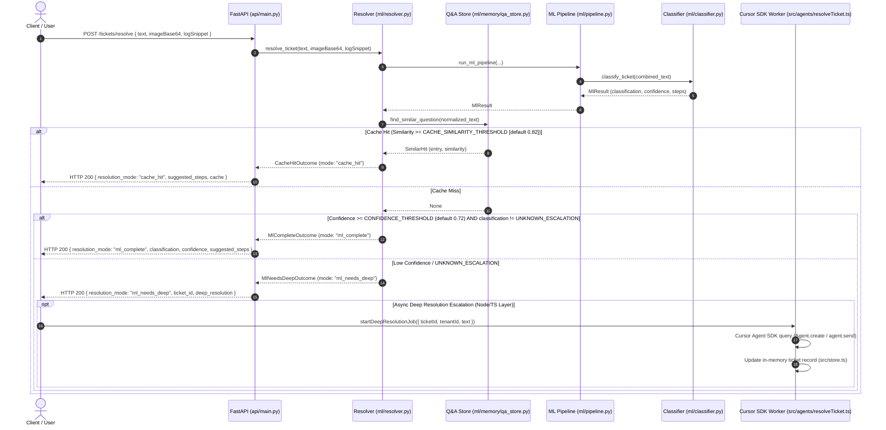

# System Architecture — Intelligent IT Ticket Auto-Resolution System

## 1. System Overview

The Intelligent IT Ticket Auto-Resolution System operates via a dual-path architecture designed to provide rapid triage for common IT issues while offering deep AI agent resolution for low-confidence or complex tickets.

```
                                +-----------------------------------+
                                |      Client / HTTP Request        |
                                |     POST /tickets/resolve        |
                                +-----------------------------------+
                                                  |
                                                  v
                                +-----------------------------------+
                                |      FastAPI (`api/main.py`)      |
                                +-----------------------------------+
                                                  |
                                                  v
                                +-----------------------------------+
                                |    Resolver (`ml/resolver.py`)    |
                                +-----------------------------------+
                                                  |
                         +------------------------+------------------------+
                         |                                                 |
                         v                                                 v
        +----------------------------------+             +----------------------------------+
        |   Q&A Cache Store Lookup         |             |   ML Feature Preprocessing       |
        |   (`ml/memory/qa_store.py`)      |             |   (`ml/preprocess.py`)           |
        +----------------------------------+             +----------------------------------+
                         |                                                 |
                         | (Match >= Threshold 0.82)                       v
                         |                               +----------------------------------+
                         |                               |   Keyword Classifier             |
                         |                               |   (`ml/classifier.py`)           |
                         |                               +----------------------------------+
                         |                                                 |
                         v                                                 v
         [ Mode: `cache_hit` ]                           [ Mode: `ml_complete` / `ml_needs_deep` ]
        Instant Response &                                 Evaluated against confidence threshold
        Token Savings                                      (Default `CONFIDENCE_THRESHOLD = 0.72`)
```

---

## 2. Sequence Diagram (Ticket Resolution Flow)



---

## 3. Core Components

### 3.1 Python FastAPI & ML Service (`api/` + `ml/`)
- **FastAPI HTTP Service (`api/main.py`)**: Exposes RESTful endpoints for ticket resolution, Q&A memory store management, and service health checking.
- **Preprocessing Pipeline (`ml/preprocess.py` + `ml/pipeline.py`)**: Normalizes whitespace, strips noise characters, truncates text to 8,000 characters, appends log snippets, and formats screenshot hints.
- **Keyword Classifier (`ml/classifier.py` + `ml/playbooks.py`)**: Matches normalized ticket text against 5 hardcoded keyword sets (`NET_VPN_DISCONNECT`, `MAIL_OUTLOOK_SYNC`, `ACC_PASSWORD_RESET`, `HW_PRINT_SPOOLER`, `APP_TEAMS_CRASH`). Computes confidence between 0.20 and 0.97 adjusted by a deterministic hash-based noise penalty heuristic (`noise_penalty`).
- **Q&A Memory Store (`ml/memory/qa_store.py` + `ml/memory/similarity.py`)**: Persists resolved Q&A entries to `data/qa-memory.json`. Evaluates candidate similarity using a character-set Jaccard/overlap calculation (`text_similarity`).

### 3.2 TypeScript / Cursor SDK Deep Resolution Worker (`src/`)
- **Agent Job Runner (`src/agents/resolveTicket.ts`)**: Invokes `@cursor/sdk` (`Agent.create` / `agent.send` or `Agent.prompt`) with model ID `composer-2` when `CURSOR_API_KEY` is present. Runs asynchronously in background jobs or one-shot mode.
- **In-Memory Ticket Store (`src/store.ts`)**: Maintains an in-memory TypeScript `Map<string, AsyncTicketRecord>` tracking status transitions (`pending` -> `deep_resolution_running` -> `deep_resolution_finished` | `deep_resolution_error`).
- **Zod Schemas (`src/schemas.ts`)**: Validates `resolveTicketBodySchema` and `ticketStatusSchema`.

---

## 4. Stubbed & Placeholder Components

The following architectural components are currently stubs or placeholders in the `v0.1.0` codebase:

1. **OCR Preprocessing Stub (`ml/preprocess.py`)**:
   - `screenshot_ocr_hint()` returns a hardcoded string (`"[Screenshot attached — OCR pending; using subject/body cues only for this demo.]"`) when `imageBase64` is provided. No actual image decoding or optical character recognition is performed.
2. **In-Memory TypeScript Ticket Store (`src/store.ts`)**:
   - Uses an in-memory `Map`. All async ticket state is lost when the Node process terminates.
3. **Single-File JSON Q&A Store (`ml/memory/qa_store.py`)**:
   - Reads and writes `data/qa-memory.json` entirely in memory during operations. Not backed by a database index or vector search engine.
4. **Python Status Polling Endpoint (`api/main.py`)**:
   - `GET /tickets/{ticket_id}/status` raises HTTP 501 (`"Deep-resolution polling not implemented in Python API yet."`).
5. **Deprecated TypeScript Fast-Path (`src/fastPath.ts`)**:
   - `src/fastPath.ts` is an empty export stub (`export {}`).
