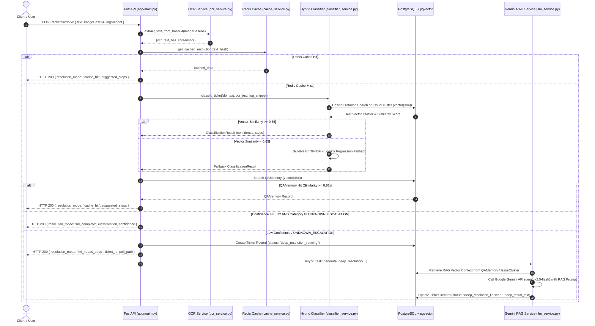

# System Architecture — Intelligent IT Ticket Auto-Resolution System (`v0.2.0`)

## 1. System Overview

In `v0.2.0`, the system was fully rewritten from TypeScript/Hono to a **Python FastAPI** service supported by **PostgreSQL + `pgvector`**, **Redis caching**, **Real pytesseract OCR**, **Hybrid Classifier** (`sentence-transformers` + `scikit-learn`), and **Google Gemini RAG Deep Resolution**.

```
                                +-----------------------------------+
                                |      Client / HTTP Request        |
                                |     POST /tickets/resolve        |
                                +-----------------------------------+
                                                  |
                                                  v
                                +-----------------------------------+
                                |     FastAPI (`app/main.py`)       |
                                +-----------------------------------+
                                                  |
                                                  v
                                +-----------------------------------+
                                |  OCR (`app/services/ocr_service`) |
                                |  Extracts text via pytesseract    |
                                +-----------------------------------+
                                                  |
                                                  v
                                +-----------------------------------+
                                | Redis Cache (`cache_service.py`)  |
                                | Normalized hash key lookup        |
                                +-----------------------------------+
                                                  |
                         +------------------------+------------------------+
                         | (Cache Miss)                                    | (Cache Hit)
                         v                                                 v
        +----------------------------------+             +----------------------------------+
        |   Q&A Memory Store Lookup        |             |   Return Instant Cache Hit       |
        |   pgvector similarity search     |             |   Tokens saved, latency < 50ms   |
        +----------------------------------+             +----------------------------------+
                         |
                         v
        +----------------------------------+
        |   Hybrid Ticket Classifier       |
        |   Sentence-Transformers (384d)   |
        |   + Scikit-Learn Fallback        |
        +----------------------------------+
                         |
                         +------------------------+------------------------+
                         | (Conf >= 0.72)                                  | (Conf < 0.72 / UNKNOWN)
                         v                                                 v
        [ Mode: `ml_complete` ]                          [ Mode: `ml_needs_deep` ]
        Instant Playbook Response                        Async RAG Deep Resolution via
                                                         Google Gemini API (`gemini-2.5-flash`)
```

---

## 2. Sequence Diagram (v0.2.0 Flow)



---

## 3. Core Components (v0.2.0)

### 3.1 Python FastAPI Application (`app/`)
- **`app/main.py`**: FastAPI entrypoint with lifecycle hooks, CORS middleware, and API router.
- **`app/api/endpoints.py`**: Implements `POST /tickets/resolve`, `GET /tickets/{id}/status`, `POST /memory/store`, `GET /health`, `GET /ml/stats`.

### 3.2 Machine Learning & Hybrid Classifier (`app/services/classifier_service.py`)
- **Primary Vector Classifier**: Encodes ticket text into 384-dimensional dense embeddings using `sentence-transformers` (`all-MiniLM-L6-v2`) and executes cosine similarity search against `pgvector` stored issue clusters.
- **Fallback Classifier**: Scikit-Learn `TfidfVectorizer` + `LogisticRegression` model trained on seed dataset, activated when vector cluster similarity is below 0.65.

### 3.3 Storage & Caching Layer (`app/core/` + `app/models/`)
- **PostgreSQL + `pgvector`**: Relational tables (`tickets`, `issue_clusters`, `qa_memory`) supporting native vector indexing (`vector(384)`).
- **Redis Cache**: Caches classification responses keyed by SHA-256 hash of normalized text.

### 3.4 OCR & Deep RAG Resolution (`app/services/`)
- **OCR Engine (`ocr_service.py`)**: Uses `pytesseract` and `Pillow` to extract raw text from base64 image bytes.
- **Deep Resolution Service (`llm_service.py`)**: RAG Deep Resolution calling Google Gemini API (`gemini-2.5-flash`) with retrieved vector matches, including a structured mock response fallback when `GEMINI_API_KEY` is not provided.
